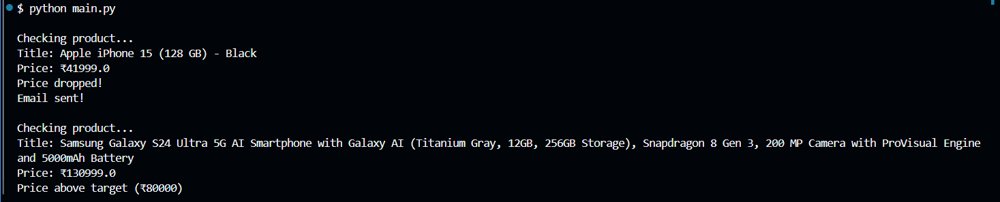

# PricePulse – Automated E-Commerce Price Tracker

## Overview

PricePulse is a Python-based price monitoring system that automatically tracks Amazon product prices and sends email alerts when prices drop below a user-defined threshold.

The system supports monitoring multiple products simultaneously, stores historical price logs in CSV format, and securely manages email credentials using environment variables.

This project automates repetitive price checking and helps users make purchasing decisions by notifying them when products reach their target budget.

---

## Features

- Multi-product price tracking
- Automated Amazon web scraping
- Threshold-based email notifications
- Historical price logging (`CSV`)
- Secure credential management using `.env`
- Error handling for invalid products and failed requests

---

## Tech Stack

- **Python**
- **Requests**
- **BeautifulSoup4**
- **lxml**
- **SMTP**
- **python-dotenv**
- **CSV**

---

## Project Structure

```txt
PricePulse/
│── main.py
│── products.json
│── requirements.txt
│── .env
│── .gitignore
│── README.md
│── price_history.csv
│── screenshots/
│   └── output.png
```

---

## How It Works

1. Product URLs and target prices are stored inside `products.json`
2. The script fetches product information from Amazon
3. Product titles and prices are extracted using BeautifulSoup
4. Prices are compared against user-defined thresholds
5. Historical price data is stored in `price_history.csv`
6. Email alerts are triggered automatically when a price falls below the target value

---

## Installation

### 1. Clone the Repository

```bash
git clone https://github.com/brishty-xo/PricePulse.git
cd PricePulse
```

### 2. Install Dependencies

```bash
pip install -r requirements.txt
```

---

## Environment Setup

Create a `.env` file in the root directory:

```env
SMTP_ADDRESS=smtp.gmail.com
EMAIL=your_email@gmail.com
PASSWORD=your_16_digit_app_password
```

### Gmail App Password Setup

To enable email alerts:

1. Turn on **2-Step Verification** in your Google Account
2. Go to **Google Account → Security → App Passwords**
3. Generate an App Password

Example App Name:

```txt
Price Tracker
```

4. Copy the generated 16-character password into `.env`

---

## Configure Products

Add products inside `products.json`.

Example:

```json
[
    {
        "url": "https://www.amazon.in/dp/B0CHX1W1XY",
        "buy_price": 40000
    },
    {
        "url": "https://www.amazon.in/dp/B0CS5XW6TN",
        "buy_price": 75000
    }
]
```

### Parameters

| Field | Description |
|--------|-------------|
| `url` | Amazon product URL |
| `buy_price` | Price threshold for triggering email alerts |

---

## Running the Project

Run the following command:

```bash
python main.py
```

---

## Example Output

Example terminal output:

```txt
Checking product...

Title: Apple iPhone 15 (128 GB) - Black
Price: ₹41999.0
Price above target (₹40000)
```

If a product falls below the target price:

```txt
Price dropped!
Email sent!
```

---

## Output Screenshot



---

## Future Improvements

- Scheduled automatic execution
- Dashboard for price trend visualization
- Multi-platform support (Flipkart, Walmart, BestBuy)
- Database integration using SQLite
- Telegram/Discord notifications

---


## Disclaimer

This project is intended for educational purposes. Website structures may change over time, which may affect scraping functionality.
